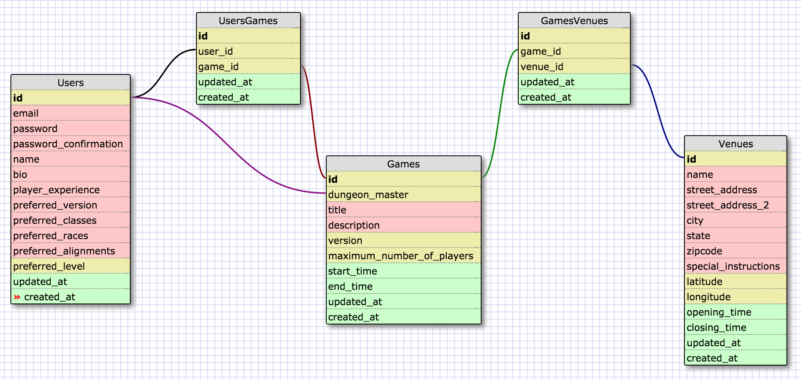

<?xml version="1.0" encoding="utf-8" ?>
<!-- SQL XML created by WWW SQL Designer, http://code.google.com/p/wwwsqldesigner/ -->
<!-- Active URL: https://socrates.devbootcamp.com/sql -->
<sql>
<datatypes db="mysql">
  <group label="Numeric" color="rgb(238,238,170)">
    <type label="Integer" length="0" sql="INTEGER" re="INT" quote=""/>
    <type label="Decimal" length="1" sql="DECIMAL" re="DEC" quote=""/>
    <type label="Single precision" length="0" sql="FLOAT" quote=""/>
    <type label="Double precision" length="0" sql="DOUBLE" re="DOUBLE" quote=""/>
  </group>

  <group label="Character" color="rgb(255,200,200)">
    <type label="Char" length="1" sql="CHAR" quote="'"/>
    <type label="Varchar" length="1" sql="VARCHAR" quote="'"/>
    <type label="Text" length="0" sql="MEDIUMTEXT" re="TEXT" quote="'"/>
    <type label="Binary" length="1" sql="BINARY" quote="'"/>
    <type label="Varbinary" length="1" sql="VARBINARY" quote="'"/>
    <type label="BLOB" length="0" sql="BLOB" re="BLOB" quote="'"/>
  </group>

  <group label="Date &amp; Time" color="rgb(200,255,200)">
    <type label="Date" length="0" sql="DATE" quote="'"/>
    <type label="Time" length="0" sql="TIME" quote="'"/>
    <type label="Datetime" length="0" sql="DATETIME" quote="'"/>
    <type label="Year" length="0" sql="YEAR" quote=""/>
    <type label="Timestamp" length="0" sql="TIMESTAMP" quote="'"/>
  </group>

  <group label="Miscellaneous" color="rgb(200,200,255)">
    <type label="ENUM" length="1" sql="ENUM" quote=""/>
    <type label="SET" length="1" sql="SET" quote=""/>
    <type label="Bit" length="0" sql="bit" quote=""/>
  </group>
</datatypes><table x="110" y="429" name="Users">
<row name="id" null="1" autoincrement="1">
<datatype>INTEGER</datatype>
<default>NULL</default></row>
<row name="email" null="1" autoincrement="0">
<datatype>MEDIUMTEXT</datatype>
<default>NULL</default></row>
<row name="password" null="1" autoincrement="0">
<datatype>MEDIUMTEXT</datatype>
<default>NULL</default></row>
<row name="password_confirmation" null="1" autoincrement="0">
<datatype>MEDIUMTEXT</datatype>
<default>NULL</default></row>
<row name="name" null="1" autoincrement="0">
<datatype>MEDIUMTEXT</datatype>
<default>NULL</default></row>
<row name="bio" null="1" autoincrement="0">
<datatype>MEDIUMTEXT</datatype>
<default>NULL</default></row>
<row name="player_experience" null="1" autoincrement="0">
<datatype>MEDIUMTEXT</datatype>
<default>NULL</default></row>
<row name="preferred_version" null="1" autoincrement="0">
<datatype>MEDIUMTEXT</datatype>
<default>NULL</default></row>
<row name="preferred_classes" null="1" autoincrement="0">
<datatype>MEDIUMTEXT</datatype>
<default>NULL</default></row>
<row name="preferred_races" null="1" autoincrement="0">
<datatype>MEDIUMTEXT</datatype>
<default>NULL</default></row>
<row name="preferred_alignments" null="1" autoincrement="0">
<datatype>MEDIUMTEXT</datatype>
<default>NULL</default></row>
<row name="preferred_level" null="1" autoincrement="0">
<datatype>INTEGER</datatype>
<default>NULL</default></row>
<row name="updated_at" null="1" autoincrement="0">
<datatype>TIME</datatype>
<default>NULL</default></row>
<row name="created_at" null="1" autoincrement="0">
<datatype>TIME</datatype>
<default>NULL</default></row>
<key type="PRIMARY" name="">
<part>id</part>
</key>
</table>
<table x="543" y="540" name="Games">
<row name="id" null="1" autoincrement="1">
<datatype>INTEGER</datatype>
<default>NULL</default></row>
<row name="dungeon_master" null="1" autoincrement="0">
<datatype>INTEGER</datatype>
<default>NULL</default><relation table="Users" row="id" />
</row>
<row name="title" null="1" autoincrement="0">
<datatype>MEDIUMTEXT</datatype>
<default>NULL</default></row>
<row name="description" null="1" autoincrement="0">
<datatype>MEDIUMTEXT</datatype>
<default>NULL</default></row>
<row name="version" null="1" autoincrement="0">
<datatype>DECIMAL</datatype>
<default>NULL</default></row>
<row name="maximum_number_of_players" null="1" autoincrement="0">
<datatype>INTEGER</datatype>
<default>NULL</default></row>
<row name="start_time" null="1" autoincrement="0">
<datatype>TIME</datatype>
<default>NULL</default></row>
<row name="end_time" null="1" autoincrement="0">
<datatype>TIME</datatype>
<default>NULL</default></row>
<row name="updated_at" null="1" autoincrement="0">
<datatype>TIME</datatype>
<default>NULL</default></row>
<row name="created_at" null="1" autoincrement="0">
<datatype>TIME</datatype>
<default>NULL</default></row>
<key type="PRIMARY" name="">
<part>id</part>
</key>
</table>
<table x="1037" y="512" name="Venues">
<row name="id" null="1" autoincrement="1">
<datatype>INTEGER</datatype>
<default>NULL</default></row>
<row name="name" null="1" autoincrement="0">
<datatype>MEDIUMTEXT</datatype>
<default>NULL</default></row>
<row name="street_address" null="1" autoincrement="0">
<datatype>MEDIUMTEXT</datatype>
<default>NULL</default></row>
<row name="street_address_2" null="1" autoincrement="0">
<datatype>MEDIUMTEXT</datatype>
<default>NULL</default></row>
<row name="city" null="1" autoincrement="0">
<datatype>MEDIUMTEXT</datatype>
<default>NULL</default></row>
<row name="state" null="1" autoincrement="0">
<datatype>MEDIUMTEXT</datatype>
<default>NULL</default></row>
<row name="zipcode" null="1" autoincrement="0">
<datatype>MEDIUMTEXT</datatype>
<default>NULL</default></row>
<row name="special_instructions" null="1" autoincrement="0">
<datatype>MEDIUMTEXT</datatype>
<default>NULL</default></row>
<row name="latitude" null="1" autoincrement="0">
<datatype>DECIMAL</datatype>
<default>NULL</default></row>
<row name="longitude" null="1" autoincrement="0">
<datatype>DECIMAL</datatype>
<default>NULL</default></row>
<row name="opening_time" null="1" autoincrement="0">
<datatype>TIME</datatype>
<default>NULL</default></row>
<row name="closing_time" null="1" autoincrement="0">
<datatype>TIME</datatype>
<default>NULL</default></row>
<row name="updated_at" null="1" autoincrement="0">
<datatype>TIME</datatype>
<default>NULL</default></row>
<row name="created_at" null="1" autoincrement="0">
<datatype>TIME</datatype>
<default>NULL</default></row>
<key type="PRIMARY" name="">
<part>id</part>
</key>
</table>
<table x="364" y="342" name="UsersGames">
<row name="id" null="1" autoincrement="1">
<datatype>INTEGER</datatype>
<default>NULL</default></row>
<row name="user_id" null="1" autoincrement="0">
<datatype>INTEGER</datatype>
<default>NULL</default><relation table="Users" row="id" />
</row>
<row name="game_id" null="1" autoincrement="0">
<datatype>INTEGER</datatype>
<default>NULL</default><relation table="Games" row="id" />
</row>
<row name="updated_at" null="1" autoincrement="0">
<datatype>TIME</datatype>
<default>NULL</default></row>
<row name="created_at" null="1" autoincrement="0">
<datatype>TIME</datatype>
<default>NULL</default></row>
<key type="PRIMARY" name="">
<part>id</part>
</key>
</table>
<table x="808" y="342" name="GamesVenues">
<row name="id" null="1" autoincrement="1">
<datatype>INTEGER</datatype>
<default>NULL</default></row>
<row name="game_id" null="1" autoincrement="0">
<datatype>INTEGER</datatype>
<default>NULL</default><relation table="Games" row="id" />
</row>
<row name="venue_id" null="1" autoincrement="0">
<datatype>INTEGER</datatype>
<default>NULL</default><relation table="Venues" row="id" />
</row>
<row name="updated_at" null="1" autoincrement="0">
<datatype>TIME</datatype>
<default>NULL</default></row>
<row name="created_at" null="1" autoincrement="0">
<datatype>TIME</datatype>
<default>NULL</default></row>
<key type="PRIMARY" name="">
<part>id</part>
</key>
</table>
</sql>
